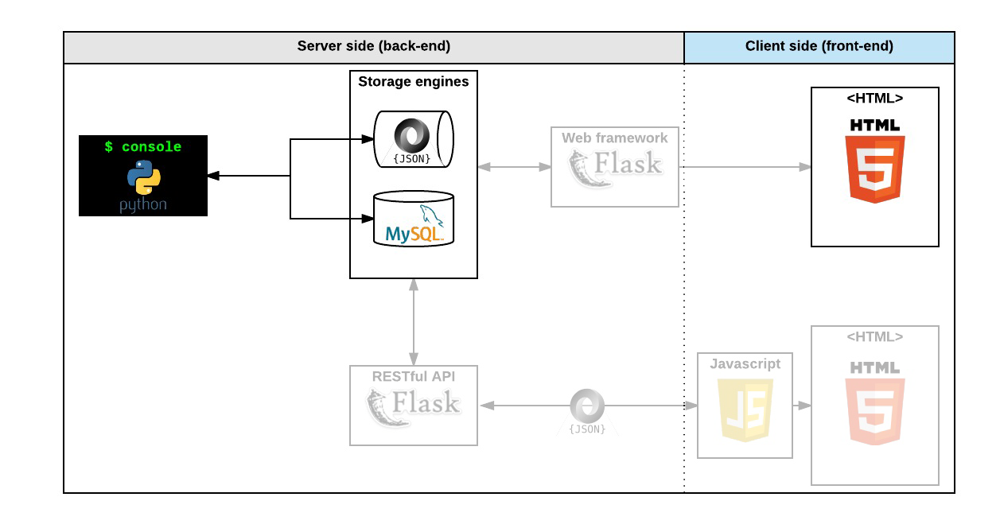

# 0x02. AirBnB clone - MySQL

## Description
Web application that simulates some of the features of Airbnb for academic purposes.

In this moment we are the third part "MySQL storage"

### Components diagram



### Database UML

[https://github.com/kael1706/AirBnB_clone/blob/master/assets/uml.jpg](https://github.com/kael1706/AirBnB_clone/blob/master/assets/uml.jpg)

## Prerequisites 📋

64-bit system , Ubuntu
Install MySQLdb module version 1.3.x
```
$ sudo apt-get install python3-dev
$ sudo apt-get install libmysqlclient-dev
$ sudo apt-get install zlib1g-dev
$ sudo pip3 install mysqlclient==1.3.10
...
$ python3
>>> import MySQLdb
>>> MySQLdb.__version__ 
'1.3.10'
```
Install SQLAlchemy module version 1.2.x
```
$ pip3 install SQLAlchemy==1.2.5
...
$ python3
>>> import sqlalchemy
>>> sqlalchemy.__version__ 
'1.2.5'
```

## Objectives

### Console

-   Create your data model
-   Manage (create, update, destroy, etc) objects via a console / command interpreter
-   Store and persist objects to a file (JSON file)

### Web Static
-   learn HTML/CSS
-   create the HTML of your application
-   create template of each objec

### MySQL storage
-   replace the file storage by a Database storage
-   map your models to a table in database by using an O.R.M.

### Web framework - templating
-   create your first web server in Python
-   make your static HTML file dynamic by using objects stored in a file or database

### RESTful API
-   expose all your objects stored via a JSON web interface
-   manipulate your objects via a RESTful API

### Web dynamic

-   learn JQuery
-   load objects from the client side by using your own RESTful API

## Console

The first piece is to manipulate a powerful storage system. This storage engine will give us an abstraction between “My object” and “How they are stored and persisted”. This means: from your console code (the command interpreter itself) and from the front-end and RestAPI you will build later, you won’t have to pay attention (take care) of how your objects are stored.

We can also use DBStorage to handle the information using a relational database like mysql. In this case we map our models into tables for the database using an ORM.

### How to start the console?
`./console.py`

### How to use the console with FileStorage?
1. Start the console
2. Write the desired command with its respective syntax

Available classes: BaseModel, User, Place, State, City, Amenity and Review

| Command| Syntax| Description|
|---|---|---|
help|`help`|print commands|
|create|`create <class>`|create a object|
|show|`show <class> <id>`|show an specific object|
|destroy|`destroy <class> <id>`|destroy an specific object|
|all|`all <class>`|show all objects by class|
|all|`all`|show all objects|
|update|`update <class> <id> <attr_name> <new_value>`|update an object with the new values|
|create|`create <class> <key name>=<value>`|create a object with arguments|
other way...

| Command| Syntax| Description|
|---|---|---|
|all|`<class name>.all()`|show all objects by class|
|count|`<class name>.count()`|a counter of specific class|
|show|`<class name>.show(<id>)`|show an specific object|
|destroy|`<class name>.destroy(<id>)`|destroy an specific object|
|update|`<class name>.update(<id>, <attribute name>, <attribute value>)`|update an object with the new values|


3. Press the enter button

### Examples:
- `(hbnb) create User`
- `(hbnb) show User fce12f8a `
- `(hbnb) destroy User fce12f8a `
- `(hbnb) all User `
- `(hbnb) all`
- `(hbnb) update User name holberton`
- `(hbnb) User.all()`
- `(hbnb) User.count()`
- `(hbnb) User.show(246c227a)`
- `(hbnb) User.destroy(246c227a)`
- `(hbnb) User.update(38f22813-2753-4d42-b37c-57a17f1e4f88, "first_name", "John")`
- `(hbnb) create User name="Hugo"`
- `(hbnb) create User edad=20`

### How to use the console with DBStorage?
0. Set up sufficient permissions to the respective database. You could try running the files: setup_mysql_dev.sql and setup_mysql_test.sql. You can also adapt it to your own database.
1. Dont start the console only write the command in the prompt
2. Write the desired command with its respective

echo 'create State name="California"' | HBNB_MYSQL_USER=hbnb_dev HBNB_MYSQL_PWD=hbnb_dev_pwd HBNB_MYSQL_HOST=localhost HBNB_MYSQL_DB=hbnb_dev_db HBNB_TYPE_STORAGE=db ./console.py 

Available classes: BaseModel, User, Place, State, City, Amenity and Review

```
echo '<filestorage command>' | HBNB_MYSQL_USER=<username> HBNB_MYSQL_PWD=<database_password> HBNB_MYSQL_HOST=<iphost> HBNB_MYSQL_DB=<name_database> HBNB_TYPE_STORAGE=db ./console.py
```

### Examples:

```
echo 'create State name="California"' | HBNB_MYSQL_USER=hbnb_dev HBNB_MYSQL_PWD=hbnb_dev_pwd HBNB_MYSQL_HOST=localhost HBNB_MYSQL_DB=hbnb_dev_db HBNB_TYPE_STORAGE=db ./console.py 
```


## Resources:books:
Read or watch:
* [cmd module](https://intranet.hbtn.io/rltoken/stklU8CC2E0LoJsq32OCOA)
* [packages](https://intranet.hbtn.io/rltoken/3UbebGAqbj8yJ0k4pga9IA)
* [unittest module](https://intranet.hbtn.io/rltoken/u7l9IP_paqAZQBk3knUzDw)
* [args/kwargs](https://intranet.hbtn.io/rltoken/Yp1tHnTVXpADhogJ31cW5w)
* [SQLAlchemy tutorial](https://intranet.hbtn.io/rltoken/KzB5FBMl5lh3orhpWtsNVQ)
* [How To Create a New User and Grant Permissions in MySQL](https://intranet.hbtn.io/rltoken/9KO9mYoUjjq0A3grVHRUxw)
* [Jimmy’s (My)SQL Cheat Sheet](https://intranet.hbtn.io/rltoken/CdIIZi6b8uNHxJuiXK3ZTw)
* [Python3 and environment variables](https://intranet.hbtn.io/rltoken/loAjB47LzpKUqAnTnW-Ejg)
* [Object Relational Mapping with Python’s SQL Alchemy](https://intranet.hbtn.io/rltoken/sTAjV8wYaUWRw3AOCBzQrA)
* [SQLAlchemy](https://intranet.hbtn.io/rltoken/ra96sKNSpT0U_6h1V0tBNA)
* [MySQL 5.7 SQL Statement Syntax](https://intranet.hbtn.io/rltoken/rjPdi3u-uyGe53UZtqvbCA)
* [AirBnB clone - ORM](https://intranet.hbtn.io/rltoken/QTQdlcgZudeEa_50A57ZfQ)
* [Isaac Wong, Cohort #5,](https://intranet.hbtn.io/rltoken/co5cdjqNmSTXvhu02pj9pQ)

---
## Learning Objectives:bulb:
What you should learn from this project:

* What is Unit testing and how to implement it in a large project
* What is *args and how to use it
* What is **kwargs and how to use it
* How to handle named arguments in a function
* How to create a MySQL database
* How to create a MySQL user and grant it privileges
* What ORM means
* How to map a Python Class to a MySQL table
* How to handle 2 different storage engines with the same codebase
* How to use environment variables

---

### [0. Fork me if you can!](./console.py)
* In the industry, you will work on an existing codebase 90% of the time. Your first thoughts upon looking at it might include:


### [1. Bug free!](./setup_mysql_dev.sql)
* Do you remember the unittest module?


### [2. Console improvements](./setup_mysql_test.sql)
* Update the def do_create(self, arg): function of your command interpreter (console.py) to allow for object creation with given parameters:


### [3. MySQL setup development](./models/engine/file_storage.py)
* Write a script that prepares a MySQL server for the project:


### [4. MySQL setup test](./models/base_model.py)
* Write a script that prepares a MySQL server for the project:


### [5. Delete object](./models/user.py)
* Update FileStorage: (models/engine/file_storage.py)


### [6. DBStorage - States and Cities](./models/place.py)
* SQLAlchemy will be your best friend!


### [7. DBStorage - User](./models/review.py)
* Update User: (models/user.py)


### [8. DBStorage - Place](./models/amenity.py)
* Update Place: (models/place.py)

#### 9. DBStorage - Review
* Update Review: (models/review.py)
* Update User: (models/user.py)
* Update Place: (models/place.py)

#### 10. DBStorage - Amenity... and BOOM!
* Update Amenity: (models/amenity.py)
* Update Place: (models/place.py)
* Update Place class

## Collaborators
* **Carlos Daniel Cortez** - [kael1706](https://github.com/kael1706)
* **Orlando Gomez Lopez** - [oran2527](https://github.com/oran2527)
